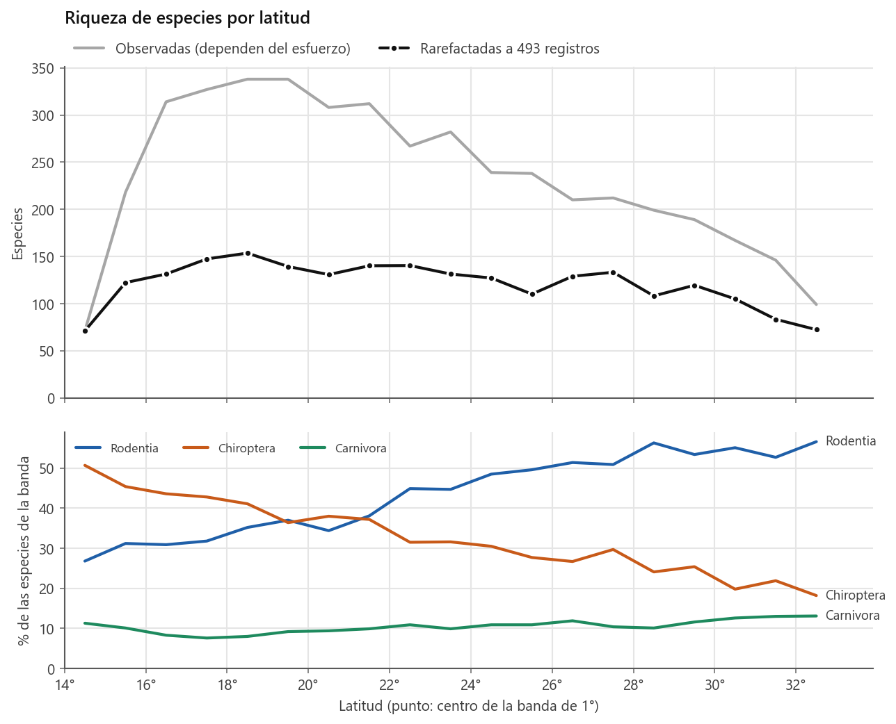
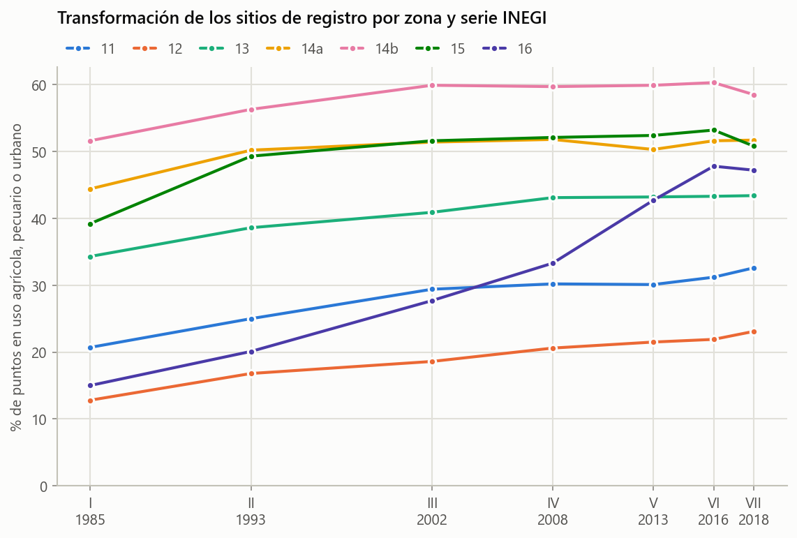
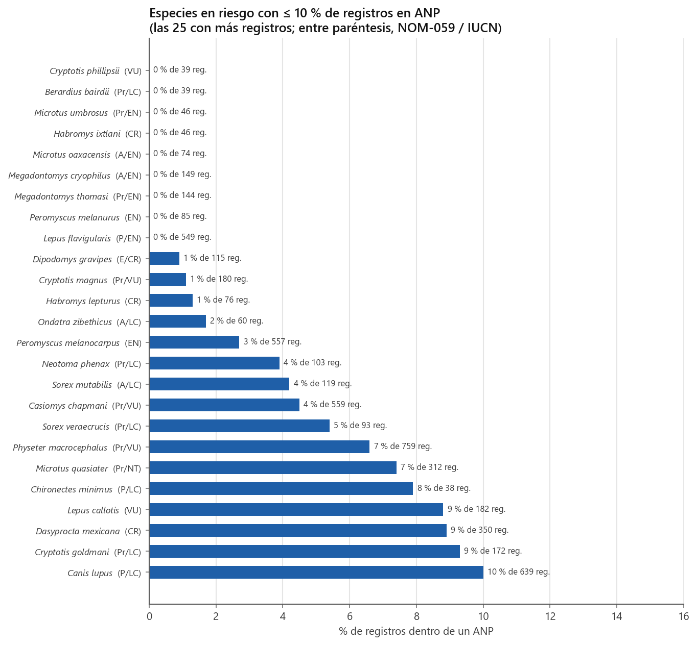
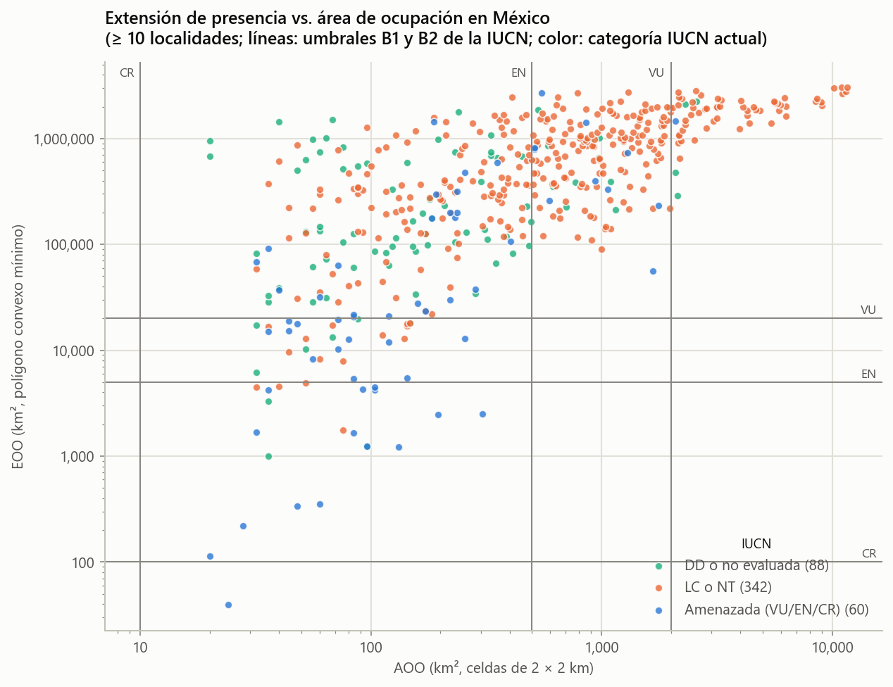

# Mamíferos de México · SNIB-CONABIO

Análisis de diversidad, distribución y conservación de los mamíferos de México a partir de los registros del **Sistema Nacional de Información sobre Biodiversidad (SNIB)**, versión 2025-03. Los datos se organizan en siete zonas UTM (11, 12, 13, 14a, 14b, 15 y 16) y se comparan con registros de Centroamérica, Estados Unidos y el Caribe.

**Reporte completo, con redacción tipo artículo y 18 figuras:** [docs/reporte_mamiferos_mexico.md](docs/reporte_mamiferos_mexico.md)

---

## Datos destacados

| | |
|---|---|
| Registros analizados | 979,688 (616,317 de México; se excluyeron 16,742 fósiles) |
| Especies nativas en México | **655** (605 terrestres, 50 marinas), en 11 órdenes terrestres |
| Especies endémicas | **201** |
| En la NOM-059 / amenazadas según la IUCN | **192** / **92** |
| Especies sin registros desde 2000 | **92** (26 en la NOM-059) |
| Sitios con vegetación natural en 1985 que hoy tienen uso antrópico | **25.1%** |

- **La colecta científica se desplomó.** Pasó de 24,000 registros en la década de 1960 a 1,000 en 2020–2025. Desde 2010, casi el 90% de los registros son observaciones ciudadanas, lo que deja con cada vez menos datos a roedores, musarañas y murciélagos.
- **Con el esfuerzo estandarizado, la riqueza es similar en el centro y el sur.** Las zonas 14b, 14a, 13 y 15 tienen entre 296 y 311 especies con 12,670 registros cada una. Las zonas difieren sobre todo en *qué* especies tienen: entre 11 y 16 comparten solo 14 especies (Jaccard = 0.05), y la diferencia se debe casi por completo a recambio.
- **Hay un reemplazo latitudinal de roedores por murciélagos.** Los murciélagos son el 51% de las especies en el extremo sur y el 18% en el norte; los roedores siguen el patrón inverso. Las curvas se cruzan entre los 20 y 22° N.
- **La alta montaña concentra endemismo y riesgo.** De las 30 especies con mayor altitud, 24 son endémicas y 13 están en riesgo, entre ellas el teporingo (*Romerolagus diazi*) y *Habromys lepturus*.
- **Las sierras de Oaxaca y Guerrero son el principal vacío de protección.** Treinta y cuatro especies en riesgo tienen 10% o menos de sus registros en ANP. Nueve no tienen ninguno, entre ellas *Lepus flavigularis*, *Megadontomys cryophilus* y *Habromys ixtlani*.
- **La NOM-059 y la IUCN coinciden solo en parte.** Treinta y una especies amenazadas globalmente no están en la norma, como *Dasyprocta mexicana* (CR) y *Tayassu pecari* (VU).
- **La península de Yucatán se transformó rápidamente.** Sus sitios de registro con uso agrícola, pecuario o urbano pasaron del 15% al 47% entre las series I y VII del INEGI.
- **Cinco roedores de distribución muy restringida alcanzan umbrales de amenaza por EOO sin estar catalogados.** Entre ellos, *Neotamias solivagus* (1,233 km²) y la tuza del Nevado de Toluca, *Cratogeomys planiceps* (1,753 km²).
- **La estacionalidad corregida por esfuerzo recupera migraciones conocidas.** *Leptonycteris yerbabuenae* alcanza su máximo en el norte en abril y en el sur en septiembre.

<table>
<tr>
<td></td>
<td></td>
</tr>
<tr>
<td></td>
<td></td>
</tr>
</table>

---

## Estructura

```
CONABIO_mamiferos/
├── mamiferos.202503.parquet/    datos del SNIB (996,430 registros, 99 campos; no se versiona)
├── mamiferos_utm14.py           comparación registro por registro de la zona 14a con el CSV de CONABIO
├── validar_zonas.py             valida los límites de las siete zonas contra los CSV de CONABIO
├── config.py                    rutas, zonas UTM, tamaño de celda, año "reciente", listas manuales
├── run_pipeline.py              pipeline: ingesta -> limpieza -> enriquecimiento -> guardado
├── ejecutar_todo.py             corre el pipeline y los 7 módulos en orden
├── pipeline/
│   ├── ingesta.py               lectura con proyección de columnas y filtros de pyarrow
│   ├── limpieza.py              nulos, tipos, taxonomía, riesgo, exóticas, ANP, duplicados
│   ├── enriquecer.py            zona UTM, celda de 0.25°, década, incertidumbre, tipo de registro
│   └── io.py                    guardado particionado y cargar_procesado()
├── analisis/
│   ├── estilo.py                paleta validada y estilo común de las figuras
│   ├── comparativo.py           riqueza, rarefacción, Chao1, diversidad beta
│   ├── mapas.py                 mapas de celdas (HTML interactivo y PNG) y mapas por especie
│   ├── conservacion.py          NOM-059 × IUCN, ANP, exóticas, especies sin registros recientes
│   ├── uso_suelo.py             series INEGI I–VII: especialización, tolerancia, cambio de uso
│   ├── temporal.py              inventario en el tiempo y estacionalidad de murciélagos
│   ├── gradientes.py            riqueza y composición por latitud y altitud
│   └── eoo_aoo.py               EOO, AOO y umbrales del criterio B de la IUCN
├── tests/                       pruebas con registros sintéticos (pytest)
├── data/procesado/              salida del pipeline (Parquet particionado por zona o país)
├── outputs/<módulo>/            tablas CSV, figuras PNG y mapas HTML; logs en outputs/logs/
├── docs/                        reporte y figuras citadas en él
├── pyproject.toml               configuración de pytest y ruff
├── CITATION.cff                 metadatos de cita
└── LICENSE                      licencia MIT
```

## Instalación

Requiere Python 3.12. Todo se ejecuta dentro del entorno virtual `venv`:

```powershell
python -m venv venv
.\venv\Scripts\python.exe -m pip install -r requirements.txt
```

Dependencias: pandas, numpy, scipy, matplotlib, seaborn, plotly, folium, pyarrow y pyproj, con las versiones fijadas en `requirements.txt`.

Los datos del SNIB no se incluyen en el repositorio. Descarga los ejemplares de mamíferos (versión 2025-03) del [portal del SNIB](https://www.snib.mx) y coloca el archivo en `mamiferos.202503.parquet/mamiferos.parquet`. `data/` y `outputs/` se regeneran con `ejecutar_todo.py`.

## Uso

Para correr todo, que tarda unos 75 s:

```powershell
.\venv\Scripts\python.exe ejecutar_todo.py
```

| Opción | Efecto |
|---|---|
| `--sin-pipeline` | reutiliza `data/procesado/` sin regenerarlo |
| `--solo mapas eoo_aoo` | corre solo los pasos indicados |
| `--continuar-si-falla` | no se detiene si un paso falla |

El script se niega a correr fuera del entorno virtual. La salida de cada paso queda en `outputs/logs/<paso>.log`.

Cada módulo también puede correrse por separado y acepta parámetros:

```powershell
.\venv\Scripts\python.exe -m analisis.comparativo --unidades 14b 15 16 GUATEMALA BELICE
.\venv\Scripts\python.exe -m analisis.mapas --especie "Tapirus bairdii" "Lynx rufus"
.\venv\Scripts\python.exe -m analisis.temporal --especies "Myotis velifer"
.\venv\Scripts\python.exe -m analisis.eoo_aoo --mapa "Romerolagus diazi"
```

Para usar los datos procesados en análisis propios:

```python
from pipeline.io import cargar_procesado
df = cargar_procesado(["14a", "14b"], columnas=["especie", "latitud", "longitud", "anio"])
```

## Pruebas

Las pruebas usan registros sintéticos que reproducen cada decisión de depuración, por lo que no necesitan los datos del SNIB. Cubren la limpieza, la asignación de zonas UTM, el guardado particionado, la rarefacción, Chao1, la diversidad beta, la EOO y la AOO, y los umbrales del criterio B:

```powershell
.\venv\Scripts\python.exe -m pip install -r requirements-dev.txt
.\venv\Scripts\python.exe -m pytest
.\venv\Scripts\ruff.exe check .
```

## Módulos y preguntas

| Módulo | Pregunta | Salidas principales |
|---|---|---|
| `comparativo` | ¿Cuántas especies tiene cada zona a igual esfuerzo y cuánto se parecen entre sí? | `tabla_resumen.csv`, `rarefaccion.png`, `beta_jaccard.png`, `intersecciones.png` |
| `mapas` | ¿Dónde hay más especies de las que explica el muestreo? | `celdas.html` (6 capas), `celdas.png`, `especie_*.html` |
| `conservacion` | ¿Qué está amenazado, qué está protegido y qué ya no se ha registrado? | `cruce_nom_iucn.png`, `vacios_anp.csv`, `sin_registro_reciente.csv` |
| `uso_suelo` | ¿Qué especies dependen de vegetación natural y cuánto cambiaron sus sitios? | `transiciones_I_VII.png`, `perdida_especies.csv`, `tolerancia.csv` |
| `temporal` | ¿Cómo se construyó el inventario? ¿Cuándo está cada murciélago migratorio en el norte y en el sur? | `registros_decada_tipo.png`, `acumulacion_especies.png`, `estacionalidad.png` |
| `gradientes` | ¿Cómo cambian la riqueza y la composición con la latitud y la altitud? | `gradiente_latitud.png`, `gradiente_altitud.png`, `alta_montana.png` |
| `eoo_aoo` | ¿Qué especies alcanzan umbrales de amenaza por su distribución restringida? | `eoo_aoo.csv`, `candidatas.csv`, `eoo_*.html` |

## Decisiones de depuración

Estas correcciones cambian los resultados de manera importante; conviene conocerlas antes de usar los datos:

1. **Nulos:** el SNIB codifica los valores nulos como el texto `\N`; se convierten a nulos reales.
2. **Subgéneros:** «*Artibeus* (*Dermanura*) *glaucus*» se convierte en *Artibeus glaucus*. Sin esta corrección, 9,115 registros de especies distintas se fusionaban en una sola.
3. **Endemismo y categorías de riesgo a nivel especie:** se toman de los registros sin subespecie y, para el endemismo, solo de registros de México. Antes, 59 especies quedaban marcadas como endémicas por tener una subespecie endémica, como *Nasua narica nelsoni*.
4. **Exóticas:** una especie se marca como exótica completa si al menos un registro lo está, más 15 especies de zoológicos o ranchos cinegéticos listadas en `config.ESPECIES_INTRODUCIDAS`.
5. **ANP:** los valores con `{a X km}` corresponden a puntos *fuera* del área. Son 227,868 registros que antes contaban como dentro.
6. **Mamíferos marinos:** se identifican también por su taxonomía (Cetacea, Sirenia y pinnípedos), no solo por el campo `ambiente`.
7. **Duplicados de evento:** mismo taxón, mismo punto y misma fecha. Se conservan como ejemplares, pero se cuentan una sola vez en los análisis de presencia.
8. **Zonas UTM:** cada zona incluye su meridiano oriental y excluye el occidental, como en los archivos por zona de CONABIO. Los siete límites de `config.ZONAS_UTM` están validados contra esos archivos (versión 2025-12): coinciden 626,674 de 626,675 registros, y la excepción es un registro marcado como de México con coordenadas en California. Para repetir la validación, coloca los `mamiferosutm<zona>.csv` en la raíz y corre `.\venv\Scripts\python.exe validar_zonas.py`.

## Limitaciones

- Los registros de presencia no son una muestra aleatoria: riqueza, EOO y cambio de uso de suelo describen los sitios muestreados, no todo el territorio.
- La AOO calculada a partir de registros es un mínimo y alcanzar un umbral del criterio B no equivale a una categoría de riesgo.
- El mapa base de los HTML (Esri) requiere conexión a internet.

## Fuente de los datos

CONABIO. 2025. *Sistema Nacional de Información sobre Biodiversidad (SNIB): ejemplares de mamíferos*, versión 2025-03. Cada registro indica su licencia de uso (campo `licenciauso`) y su forma de citar (campo `formadecitar`); revísalos antes de publicar resultados derivados.

## Cómo citar

Si usas este código o sus resultados, cita el repositorio y la fuente de los datos. Los metadatos están en [`CITATION.cff`](CITATION.cff); GitHub los muestra en el botón *Cite this repository*.

> Rico, D. 2026. *Mamíferos de México: diversidad, distribución y conservación a partir del SNIB-CONABIO* (versión 0.1.0) [Software]. Licencia MIT.

## Autor

**Daniel Rico** · [@Daniel-RM-94](https://github.com/Daniel-RM-94)

## Licencia

El código se distribuye bajo la [licencia MIT](LICENSE). La licencia no cubre los datos del SNIB, que conservan las condiciones de uso de cada registro establecidas por la CONABIO.
