# Diversidad, distribución y estado de conservación de los mamíferos de México a partir de los registros del SNIB: un análisis por zonas UTM

*Reporte técnico · Septiembre de 2026 · Datos: SNIB-CONABIO, ejemplares de mamíferos, versión 2025-03*

---

## Resumen

Se analizaron 979,688 registros de mamíferos del Sistema Nacional de Información sobre Biodiversidad (SNIB), de los cuales 616,317 corresponden a México y se organizaron en siete zonas UTM (11, 12, 13, 14a, 14b, 15 y 16). Tras la depuración taxonómica y geográfica, el conjunto incluye 655 especies nativas (605 terrestres y 50 marinas) y 201 especies endémicas. La construcción del inventario ha sido heterogénea en el tiempo: las colecciones científicas alcanzaron su máximo en la década de 1960 y, desde 2010, más del 85% de los registros provienen de observaciones de ciencia ciudadana. Al estandarizar el esfuerzo de muestreo mediante rarefacción, las zonas 14b, 14a, 13 y 15 presentan la mayor riqueza (296–311 especies en 12,670 registros), y las zonas 11 (Baja California, 117 especies) y 16 (península de Yucatán, 158 especies) la menor. La similitud faunística disminuye con la distancia geográfica (Jaccard de 0.72 entre las zonas 14a y 14b, y de 0.05 entre las zonas 11 y 16) y responde casi por completo a recambio de especies. Se observó un gradiente latitudinal en la composición: los murciélagos representan el 51% de las especies en el extremo sur y el 18% en el norte, mientras que los roedores muestran el patrón opuesto. De las 655 especies nativas, 192 se encuentran listadas en la NOM-059-SEMARNAT-2010 y 92 están amenazadas según la IUCN; 31 especies amenazadas globalmente no figuran en la norma mexicana. Treinta y cuatro especies en riesgo tienen 10% o menos de sus registros dentro de Áreas Naturales Protegidas (ANP), la mayoría endémicas de las sierras de Oaxaca y Guerrero. De los sitios de registro que en 1985 tenían vegetación natural, el 25% corresponde hoy a uso agrícola, pecuario o urbano, y la zona 16 pasó del 15% al 47% de sitios transformados. Noventa y dos especies no tienen registros desde el año 2000. El cálculo de la extensión de presencia identificó cinco especies de roedores, cuatro de ellas endémicas, que alcanzan umbrales de amenaza del criterio B de la IUCN sin estar catalogadas en ninguna lista de riesgo.

**Palabras clave:** Mammalia, SNIB, rarefacción, diversidad beta, NOM-059, áreas naturales protegidas, cambio de uso de suelo, extensión de presencia.

## Abstract

We analyzed 979,688 mammal records from Mexico's National Biodiversity Information System (SNIB); 616,317 records from Mexico were organized into seven UTM zones. After taxonomic and geographic cleaning, the dataset comprises 655 native species (605 terrestrial, 50 marine) and 201 endemics. Knowledge accumulation has been uneven: museum collecting peaked in the 1960s and, since 2010, over 85% of records come from citizen-science observations. After rarefaction, zones 14b, 14a, 13 and 15 hold the highest richness (296–311 species per 12,670 records). Faunal similarity decays with distance (Jaccard 0.72 between zones 14a and 14b; 0.05 between zones 11 and 16) and is driven almost entirely by species turnover. Bats make up 51% of species in the southernmost latitudes and 18% in the north, with rodents showing the reverse trend. Of the native species, 192 are listed in Mexico's NOM-059 and 92 are globally threatened (IUCN); 31 globally threatened species are absent from the national list. Thirty-four at-risk species have 10% or less of their records inside protected areas. Of the sites with natural vegetation in 1985, 25% are now agricultural, pastoral or urban land, and in the Yucatán Peninsula (zone 16) the share of transformed sites rose from 15% to 47%. Ninety-two species lack records since 2000. Extent of occurrence analysis flagged five rodent species, four of them endemic, that meet IUCN criterion B thresholds but are not listed in any risk category.

---

## Introducción

México es uno de los países con mayor riqueza de mamíferos del mundo, con 564 especies silvestres reconocidas, de las cuales 157 (28%) son endémicas y 41 son marinas (Sánchez-Cordero *et al.*, 2014). Esta diversidad se concentra en tres órdenes, Rodentia, Chiroptera y Soricomorpha, formados sobre todo por especies de talla pequeña. El conocimiento sobre la distribución de estas especies se ha construido durante más de dos siglos a partir de ejemplares de colecciones científicas y, en las últimas dos décadas, de observaciones de ciencia ciudadana y de fototrampeo.

El Sistema Nacional de Información sobre Biodiversidad (SNIB), administrado por la CONABIO, integra estos registros en una sola base con taxonomía homologada, georreferenciación validada y atributos asociados a cada punto: categorías de riesgo, endemismo, pertenencia a ANP y el tipo de vegetación y uso de suelo en las siete series cartográficas del INEGI. Sin embargo, los registros de presencia no son una muestra aleatoria del territorio. El esfuerzo de muestreo varía entre regiones, épocas y tipos de registro, y esta variación puede confundirse con los patrones biológicos si no se controla.

El objetivo de este trabajo fue describir los patrones de diversidad, distribución y conservación de los mamíferos de México a partir de la versión 2025-03 del SNIB. Se analizaron siete zonas UTM y se prestó especial atención a separar los patrones biológicos de los sesgos de muestreo. Los análisis abarcan: (1) la construcción histórica del inventario; (2) la riqueza y la composición entre zonas; (3) los gradientes latitudinal y altitudinal; (4) el estado de conservación y la cobertura de las ANP; (5) el cambio de uso de suelo en los sitios de registro; (6) la estacionalidad de murciélagos migratorios, y (7) la extensión de presencia y el área de ocupación de cada especie.

## Materiales y métodos

**Fuente de datos.** Se utilizó la base de ejemplares de mamíferos del SNIB, versión 2025-03, en formato Parquet (996,430 registros, 99 campos). La base incluye registros de México y de otros 29 países de América. Se excluyeron los 16,742 registros fósiles. Para México, los registros se asignaron a siete zonas definidas por meridianos UTM: 11 (al oeste de 114° O), 12 (114–108° O), 13 (108–102° O), 14a (102–99° O), 14b (99–96° O), 15 (96–90° O) y 16 (al este de 90° O). La zona 14a reproduce exactamente el criterio que utiliza la CONABIO para el archivo de esa zona; esto se verificó registro por registro.

**Depuración.** Además de convertir los valores nulos y los tipos de dato, se aplicaron las siguientes correcciones:
1. Se obtuvo el binomio de cada especie eliminando el subgénero. Por ejemplo, «*Artibeus* (*Dermanura*) *glaucus*» se convirtió en *A. glaucus*. Sin esta corrección, especies distintas se fusionaban en una sola.
2. El endemismo y las categorías de riesgo se asignaron a nivel especie a partir de los registros sin subespecie. De otro modo, una subespecie endémica, como *Nasua narica nelsoni* de Cozumel, hacía que se marcara como endémica a toda la especie. Esto afectaba a 59 especies.
3. Se marcaron como exóticas las especies con al menos un registro señalado como exótico en el SNIB, junto con 15 especies de zoológicos, ranchos cinegéticos o mascotas que el SNIB no marca. En total fueron 30 especies.
4. Se consideró que un registro está dentro de un ANP solo cuando el SNIB no indica una distancia al área. De los 492,024 registros con información de ANP, 227,868 corresponden a puntos cercanos a un ANP pero fuera de ella.
5. Se clasificaron como mamíferos marinos todos los registros de Cetacea, Sirenia y pinnípedos, incluidos los que carecían del campo de ambiente.
6. Se identificaron los duplicados de evento, es decir, registros del mismo taxón en el mismo punto y la misma fecha. Se conservaron como ejemplares, pero se contaron una sola vez en los análisis de presencia.

Con estas correcciones, el conjunto analizado para las especies nativas terrestres de México incluye 267,786 registros únicos de evento.

**Riqueza y diversidad beta.** Para comparar la riqueza entre zonas se estandarizó el esfuerzo mediante rarefacción basada en registros (Hurlbert, 1971; Gotelli y Colwell, 2001). La riqueza total se estimó con el estimador Chao1 (Chao, 1984) y la cobertura de muestreo según Chao y Jost (2012). La diversidad beta se evaluó con los índices de Jaccard y de Sørensen, y este último se descompuso en recambio y anidamiento (Baselga, 2010). Los patrones espaciales se describieron en celdas de 0.25°. En cada celda se comparó la riqueza observada con la esperada según su esfuerzo, mediante una regresión cuadrática entre el logaritmo de la riqueza y el logaritmo del número de registros.

**Gradientes.** La riqueza se calculó en bandas de 1° de latitud y de 250 m de altitud. Para la altitud se excluyeron los registros con incertidumbre de georreferencia mayor a 1 km. Solo se rarefactaron las bandas con al menos 300 registros.

**Conservación.** Se cruzaron las categorías de la NOM-059-SEMARNAT-2010 (SEMARNAT, 2010, 2019) con las de la Lista Roja de la IUCN. Se calculó el porcentaje de registros dentro de ANP por zona y por especie, y se identificaron las especies sin registros desde el año 2000.

**Uso de suelo.** Las 338 clases de uso de suelo y vegetación de las series I a VII del INEGI se agruparon en seis condiciones (primaria, secundaria, pastizal o bosque inducido, agrícola, urbana y agua o sin vegetación) y en nueve formaciones vegetales (Rzedowski, 1978). A cada registro se le asignó la serie más cercana a su año de colecta, para obtener el uso de suelo contemporáneo al registro. La amplitud de nicho entre formaciones se midió con el índice estandarizado de Levins (1968). El cambio de uso de suelo se evaluó comparando las series I (~1985) y VII (~2018) en 75,810 sitios únicos.

**Estacionalidad.** Para seis especies de murciélagos migratorios se calculó un índice mensual corregido por esfuerzo: la proporción que representa la especie entre todos los registros de murciélagos de cada mes, dividida entre su proporción anual. El índice se calculó con una ventana móvil de tres meses y por separado para el norte (≥ 24° N) y el sur del país.

**Extensión de presencia y área de ocupación.** La extensión de presencia (EOO) se calculó como el área del polígono convexo mínimo y el área de ocupación (AOO) como el número de celdas de 2 × 2 km ocupadas. Las áreas se midieron en una proyección cónica equivalente de Albers centrada en México. Los resultados se compararon con los umbrales de los subcriterios B1 y B2 de la IUCN (IUCN Standards and Petitions Committee, 2024), con todos los registros y con los registros desde 2000. No se evaluaron las especies con menos de diez localidades.

Todos los análisis se realizaron en Python 3.12 con pandas, pyarrow, SciPy, Matplotlib, folium y pyproj. El código completo se encuentra en este repositorio y los resultados se reproducen con el comando `ejecutar_todo.py`.

---

## Resultados y discusión

### Construcción histórica del inventario

El conocimiento sobre los mamíferos de México se ha construido de manera muy desigual en el tiempo (Fig. 1). Las colecciones científicas aportaron el grueso de los registros entre las décadas de 1940 y 2000, con un máximo de 24,000 registros en la década de 1960, y desde entonces han declinado de forma sostenida: en 2020–2025 aportaron apenas 1,000 registros. En contraste, las observaciones humanas, provenientes sobre todo de la plataforma Naturalista, pasaron de 3,200 registros en la década de 1990 a 40,300 en la de 2010 y a 46,700 en el periodo 2020–2025. Los registros automáticos, de fototrampeo y detección acústica, son todavía una fracción menor (2,300 eventos únicos).

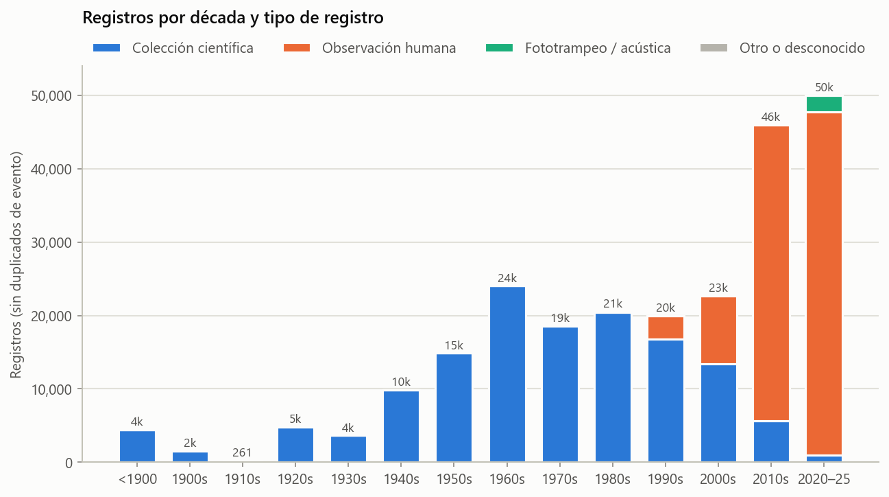
**Figura 1.** Registros de especies nativas terrestres por década y tipo de registro, sin duplicados de evento.

Este cambio en la fuente de los datos tiene consecuencias para la interpretación. Las observaciones ciudadanas favorecen a las especies diurnas, grandes o fáciles de fotografiar, y se concentran cerca de los centros urbanos. En cambio, los roedores pequeños, las musarañas y la mayoría de los murciélagos requieren captura para identificarse, y su registro depende casi por completo de las colecciones. Por ello, la ausencia de registros recientes de estos grupos debe interpretarse con cautela.

Las curvas de acumulación muestran que las zonas del centro y el sur del país (13, 14a, 14b y 15) alcanzaron el 90% de su inventario actual entre 1976 y 1985, en coincidencia con el periodo de mayor actividad de colecta. La zona 11 (Baja California) lo hizo desde 1949, mientras que la zona 16 (península de Yucatán) no lo alcanzó sino hasta 1995 y es la que más especies ha incorporado desde 2000 (16 especies, el 9.8% de su inventario). Entre las adiciones recientes destacan registros del armadillo *Dasypus novemcinctus* en tres zonas distintas (12, 13 y 16) en 2019–2023, lo que es consistente con la expansión de la especie.

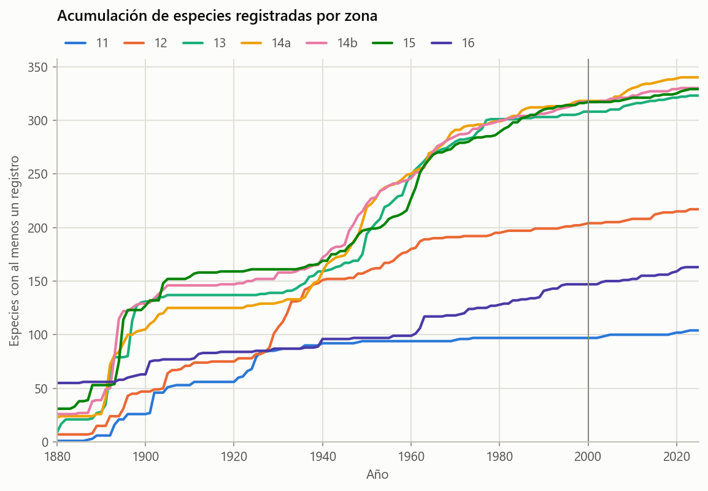
**Figura 2.** Especies acumuladas por año en cada zona UTM, según el primer registro fechado de cada especie en la zona.

### Riqueza y composición entre zonas

El conjunto depurado contiene 655 especies nativas para México, de las cuales 605 son terrestres, en 11 órdenes, 37 familias y 180 géneros. Rodentia (276 especies) y Chiroptera (185) concentran el 76% de las especies terrestres, seguidos por Soricomorpha (50) y Carnivora (39). La cifra total supera las 564 especies reconocidas por Sánchez-Cordero *et al.* (2014). La diferencia se explica por tres factores: las separaciones taxonómicas posteriores a esa revisión, el uso de la taxonomía válida del catálogo de la CONABIO y la presencia de registros dudosos. Sobre estos últimos, 109 especies tienen menos de diez localidades en México y entre ellas hay especies claramente fuera de su distribución, como *Chinchilla lanigera* o *Phyllops falcatus*. El número de especies endémicas (201) también supera las 157 reportadas en esa revisión, por las mismas razones.

La riqueza observada por zona varía entre 117 especies (zona 11) y 366 especies (zona 14a), pero esta diferencia refleja en parte el esfuerzo: la zona 13 tiene cinco veces más registros que la 11 (Cuadro 1). Al estandarizar a 12,670 registros, las zonas 14b (311 especies), 14a (304), 13 (298) y 15 (296) resultan prácticamente equivalentes, y la zona 12 (216) y la 16 (158) quedan claramente por debajo (Fig. 3). La completitud del inventario, es decir, la proporción de las especies estimadas por Chao1 que ya se han registrado, va del 86% en la zona 12 al 96% en la zona 16. Esto sugiere que el noroeste y el centro-occidente aún tienen especies por registrar.

**Cuadro 1.** Riqueza de mamíferos nativos terrestres por zona UTM. Riqueza rarefactada a 12,670 registros; completitud = especies observadas / Chao1.

| Zona | Registros | Especies | Rarefactadas | Chao1 | Completitud (%) | Endémicas | NOM-059 | IUCN VU/EN/CR |
|---|---:|---:|---:|---:|---:|---:|---:|---:|
| 11 | 12,670 | 117 | 117.0 | 134.1 | 87.2 | 14 | 23 | 7 |
| 12 | 23,413 | 230 | 215.8 | 267.5 | 86.0 | 46 | 42 | 17 |
| 13 | 63,026 | 348 | 298.0 | 399.0 | 87.2 | 108 | 64 | 27 |
| 14a | 57,068 | 366 | 303.9 | 416.6 | 87.8 | 116 | 71 | 34 |
| 14b | 43,388 | 356 | 311.0 | 387.5 | 91.9 | 104 | 76 | 39 |
| 15 | 46,085 | 345 | 296.3 | 363.6 | 94.9 | 72 | 80 | 34 |
| 16 | 22,136 | 167 | 158.4 | 173.5 | 96.3 | 19 | 39 | 9 |

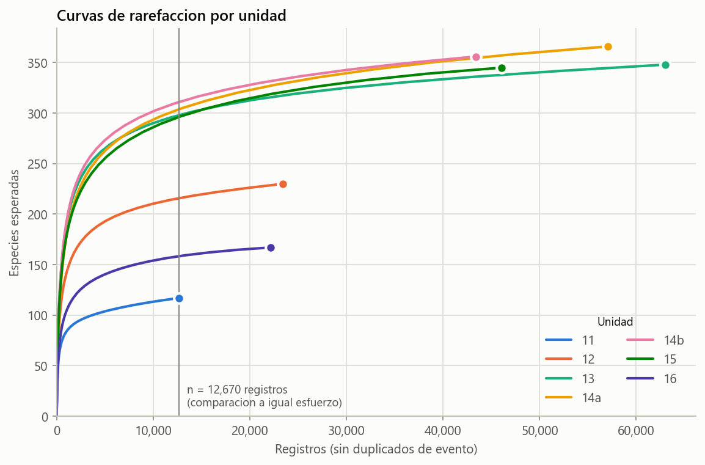
**Figura 3.** Curvas de rarefacción por zona. La línea vertical indica el esfuerzo común (12,670 registros) al que se compara la riqueza.

La composición taxonómica cambia de manera gradual de oeste a este (Fig. 4). Los roedores representan el 54% de las especies de la zona 11 y solo el 17% de la zona 16, mientras que los murciélagos pasan del 21% al 52%. Las zonas 13, 14a y 14b concentran además la mayor proporción de musarañas (6–8% de sus especies) y el mayor número de especies endémicas (104–116), lo que coincide con los centros de endemismo del Eje Neovolcánico Transversal y de las sierras madres.

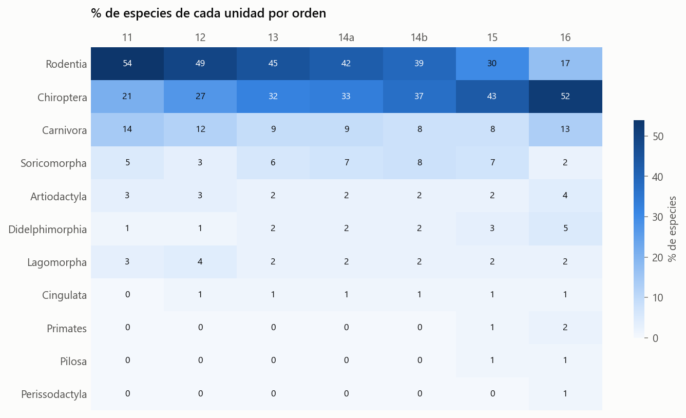
**Figura 4.** Porcentaje de las especies de cada zona que pertenece a cada orden.

La similitud entre zonas disminuye con la distancia (Fig. 5). Los pares más parecidos son las zonas contiguas del centro del país: 14a–14b (Jaccard = 0.72, con 301 especies compartidas) y 13–14a (0.67). El par más distinto es 11–16 (0.05), que comparte solo 14 especies. En casi todos los pares, la disimilitud se debe al recambio de especies y no al anidamiento: el componente de recambio es de 0.88 en el par 11–16 y el de anidamiento de apenas 0.02. Esto indica que la fauna de las zonas más pobres no es un subconjunto de la de las zonas más ricas, sino un conjunto distinto de especies. La zona 15 (Veracruz sur, Oaxaca oriental, Tabasco y Chiapas) es la que tiene más especies exclusivas (55), entre ellas la liebre de Tehuantepec (*Lepus flavigularis*) y *Peromyscus zarhynchus*, ambas endémicas.

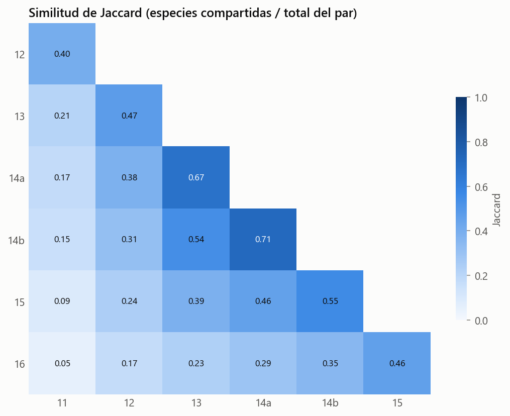
**Figura 5.** Similitud de Jaccard entre pares de zonas UTM.

### Patrones espaciales de riqueza y esfuerzo

A una resolución de 0.25°, los mapas de riqueza y de esfuerzo de muestreo son casi idénticos (Fig. 6): las celdas con más especies son también las más muestreadas. Al comparar la riqueza observada con la esperada según el esfuerzo de cada celda, surge un patrón distinto. Las celdas con más especies de las esperadas se concentran en el sur (zonas 14b y 15: Veracruz, Oaxaca y Chiapas), y las celdas con menos especies de las esperadas dominan el noroeste y la península de Baja California. La celda con la mayor riqueza relativa se ubica en el centro de Veracruz (≈ 19.1° N, 97.1° O), con 128 especies en solo 312 registros, 2.5 veces lo esperado. Los mapas de especies endémicas y de especies en riesgo destacan el Eje Neovolcánico, la Sierra Madre del Sur y Chiapas.

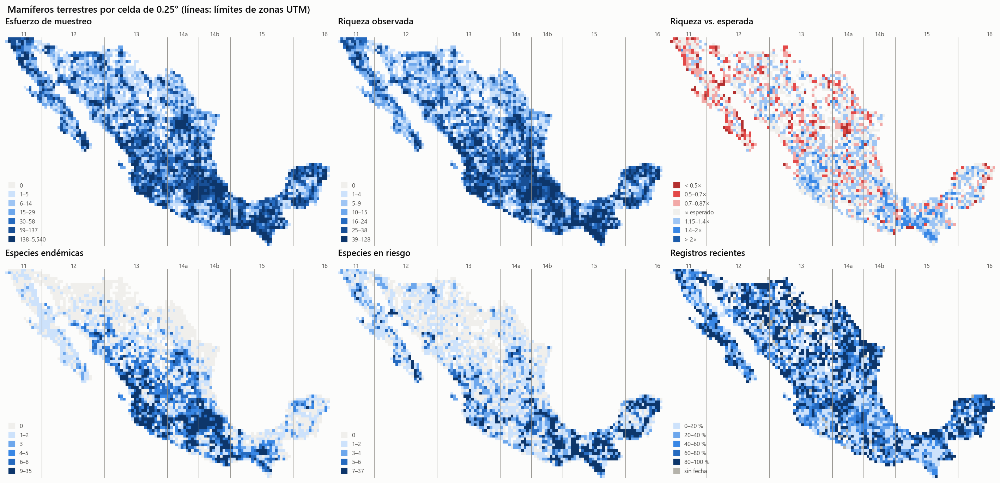
**Figura 6.** Métricas por celda de 0.25°: esfuerzo, riqueza observada, riqueza respecto a la esperada, especies endémicas, especies en riesgo y proporción de registros posteriores a 2000. Las líneas verticales son los límites de las zonas UTM. El archivo `outputs/mapas/celdas.html` contiene la versión interactiva.

### Gradientes latitudinal y altitudinal

La riqueza observada disminuye de 339 especies en la banda de 19° N a 99 especies en la de 32° N. Sin embargo, gran parte de este gradiente es producto del esfuerzo: con la riqueza rarefactada a 471 registros por banda, el valor se mantiene casi constante, entre 121 y 152 especies, desde los 15° hasta los 24° N, y solo desciende de manera marcada por encima de los 30° N (72–104 especies; Fig. 7). El cambio más notable es de composición: los murciélagos pasan del 51% de las especies en la banda de 14° N al 18% en la de 32° N, y los roedores del 27% al 58%. Ambas curvas se cruzan entre los 20 y 22° N, latitud que coincide aproximadamente con la transición entre las regiones neártica y neotropical.


**Figura 7.** Riqueza observada y rarefactada por banda de 1° de latitud (arriba) y porcentaje de especies de los tres órdenes principales (abajo).

En el gradiente altitudinal, la riqueza rarefactada a 439 registros se mantiene en unas 160 especies desde el nivel del mar hasta los 1,000 m y desciende de manera gradual hasta unas 75 especies a los 3,500 m (Fig. 8). No se observó un pico de riqueza a altitudes intermedias. Con la altitud, los murciélagos pasan del 35% al 15% de las especies y los roedores dominan los ambientes de montaña. Las musarañas son el orden más montano, con una altitud mediana de unos 2,150 m.

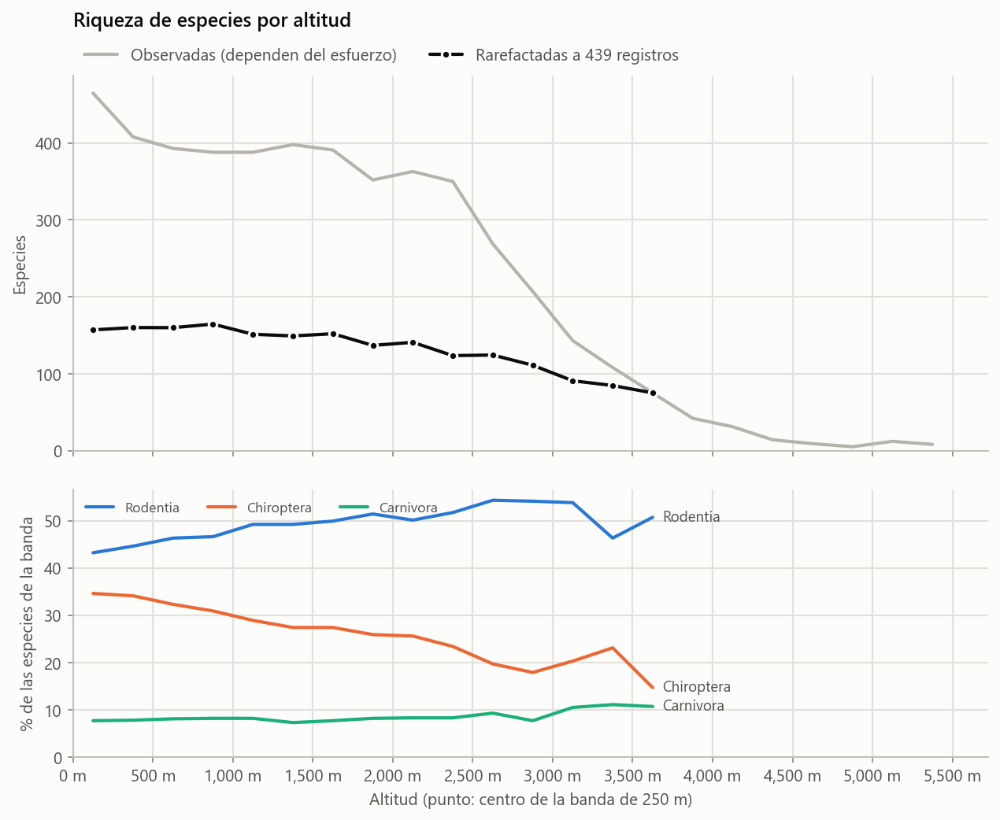
**Figura 8.** Riqueza observada y rarefactada por banda de 250 m de altitud (arriba) y composición por orden (abajo).

La alta montaña concentra endemismo y riesgo. De las 30 especies con mayor altitud mediana, 24 son endémicas y 13 están en alguna categoría de riesgo (Fig. 9). Entre ellas están el teporingo (*Romerolagus diazi*, P/EN), *Cryptotis alticola*, *Habromys lepturus* (CR), *Microtus umbrosus* (Pr/EN) y *Neotamias solivagus*. En general, las especies endémicas tienen una altitud mediana de 1,644 m, frente a 456 m de las no endémicas. Son especies con poco margen para desplazarse hacia mayor altitud y, por tanto, de alta prioridad ante el cambio climático.

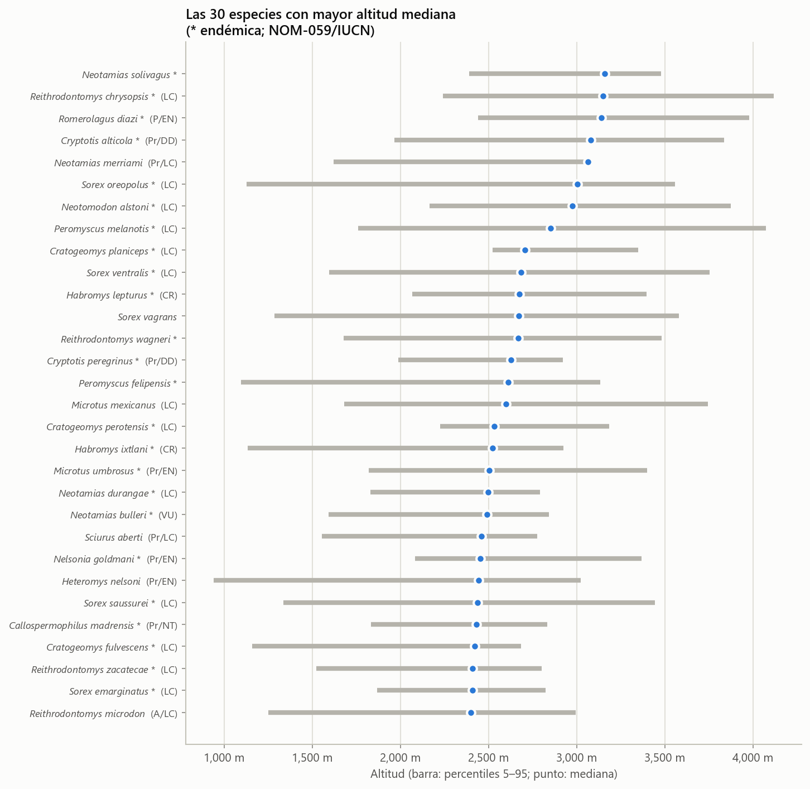
**Figura 9.** Rango altitudinal (percentiles 5 a 95) de las 30 especies con mayor altitud mediana. El asterisco indica especie endémica; entre paréntesis, las categorías NOM-059/IUCN.

### Estado de conservación

De las 655 especies nativas, 192 están incluidas en la NOM-059-SEMARNAT-2010: 83 sujetas a protección especial (Pr), 67 amenazadas (A), 38 en peligro de extinción (P) y 4 probablemente extintas en el medio silvestre (E). En la Lista Roja de la IUCN, 92 especies están en categorías de amenaza (27 VU, 40 EN y 25 CR). Ambas listas coinciden solo parcialmente (Fig. 10):

- **31 especies amenazadas globalmente no figuran en la NOM-059**, entre ellas el agutí negro (*Dasyprocta mexicana*, CR), el jabalí de labios blancos (*Tayassu pecari*, VU), *Peromyscus melanocarpus* (EN) y *Handleyomys chapmani* (VU).
- **14 especies en peligro según la norma están en preocupación menor (LC) según la IUCN**, como el ocelote, el oso negro, el berrendo y el perrito de la pradera de cola negra. Esta diferencia refleja la escala de evaluación: la NOM-059 evalúa el estado de las poblaciones mexicanas, que suelen estar en el borde de la distribución de estas especies.
- **133 especies no están en la NOM-059 y tampoco han sido evaluadas por la IUCN.**

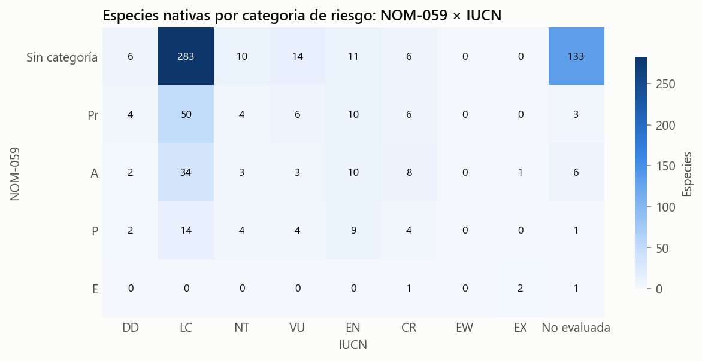
**Figura 10.** Número de especies nativas por combinación de categorías NOM-059 × IUCN.

**Cobertura de áreas naturales protegidas.** El porcentaje de registros dentro de un ANP varía entre el 16% (zona 14b) y el 37% (zona 12). En las zonas del noroeste (11 y 12) y en la península de Yucatán (16), los registros de especies en riesgo están mejor representados en las ANP que el conjunto de registros (40–47%). En el noroeste esto se debe sobre todo a mamíferos marinos y endémicos insulares registrados en ANP marinas e insulares, como Bahía de Loreto, las Islas del Golfo de California y las Islas del Pacífico de la Península de Baja California. En la península de Yucatán se debe a reservas terrestres como Calakmul, Otoch Ma'ax Yetel Kooh y Sian Ka'an. En la zona 14b ocurre lo contrario: solo el 14% de los registros de especies en riesgo cae dentro de un ANP, y 43 de sus 114 especies en riesgo nunca se han registrado dentro de una (Fig. 11, Cuadro 2).

**Cuadro 2.** Registros dentro de ANP por zona, incluidos los mamíferos marinos. Solo se consideran los puntos que caen dentro del polígono del área.

| Zona | % de todos los registros | % de registros de especies en riesgo | Especies en riesgo | Nunca registradas en un ANP |
|---|---:|---:|---:|---:|
| 11 | 33.7 | 43.3 | 71 | 10 |
| 12 | 36.5 | 47.0 | 105 | 23 |
| 13 | 19.7 | 19.7 | 107 | 33 |
| 14a | 29.0 | 27.1 | 108 | 31 |
| 14b | 16.1 | 13.6 | 114 | 43 |
| 15 | 33.1 | 28.9 | 120 | 25 |
| 16 | 25.4 | 40.4 | 61 | 12 |

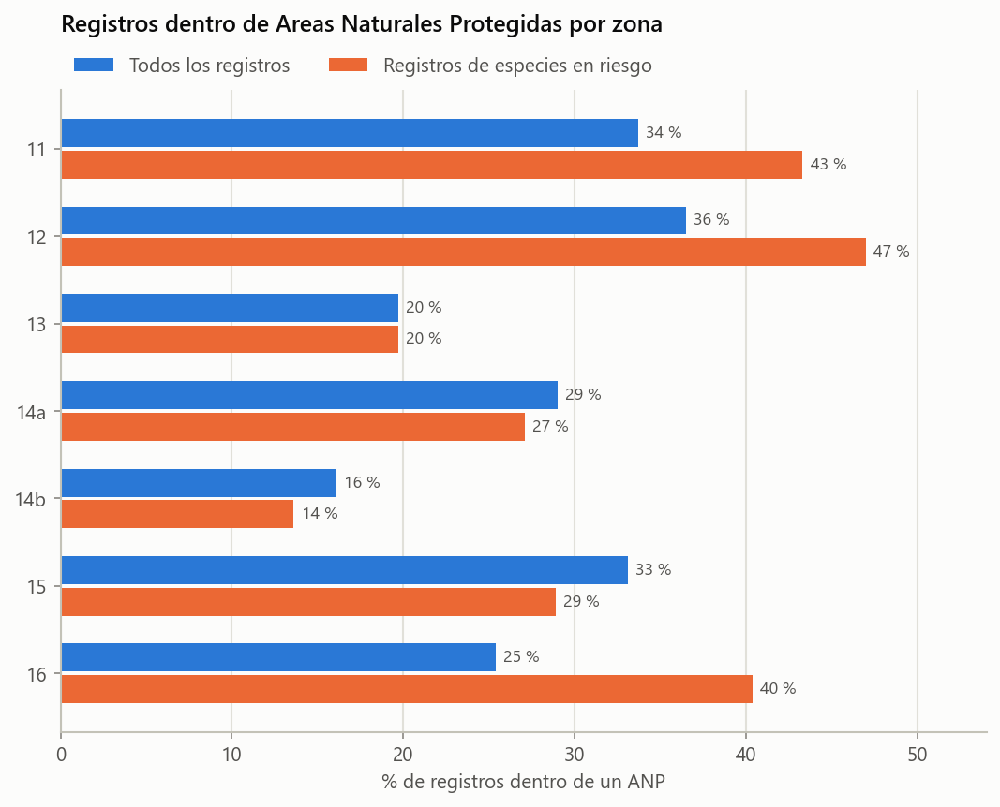
**Figura 11.** Porcentaje de registros dentro de ANP por zona: todos los registros y registros de especies en riesgo.

Treinta y cuatro especies en riesgo tienen al menos 20 registros, pero 10% o menos de ellos dentro de un ANP (Fig. 12). Nueve de ellas no tienen ningún registro en un ANP, entre ellas la liebre de Tehuantepec (*Lepus flavigularis*, P/EN, 548 registros), los ratones *Megadontomys cryophilus* (A/EN) y *M. thomasi* (Pr/EN), *Habromys ixtlani* (CR), *Microtus oaxacensis* (A/EN) y *M. umbrosus* (Pr/EN). Casi todas son endémicas de las sierras de Oaxaca y Guerrero, lo que señala a esta región como el principal vacío de protección para los mamíferos del país.


**Figura 12.** Especies en riesgo con ≤ 10% de sus registros dentro de ANP (las 25 con más registros).

**Especies sin registros recientes.** Noventa y dos especies nativas no tienen registros desde el año 2000, y 26 de ellas están en la NOM-059. La lista incluye especies extintas reconocidas, como la foca monje del Caribe (*Neomonachus tropicalis*, último registro en 1889) y el ratón de la isla San Pedro Nolasco (*Peromyscus pembertoni*, 1931). También incluye especies en peligro crítico con muy pocos registros históricos: la rata cambalachera de Perote (*Neotoma nelsoni*, 1951), *Sorex sclateri* (1967), *Peromyscus guardia* (1968) y *Tylomys bullaris* (1971). La zona 15 concentra el mayor número de especies sin registros recientes en todo el país (43). Dado que la mayoría de estas especies son roedores y musarañas que solo se registran mediante captura, su ausencia en los datos recientes puede reflejar tanto declives reales como el abandono de la colecta científica.

**Especies exóticas.** Se identificaron 30 especies exóticas, con 6,151 registros únicos en México. El perro doméstico (1,596 registros), el gato (1,434), el ratón doméstico (1,004) y la rata negra (517) están presentes en las siete zonas. Los registros de perros, gatos y ganado son casi todos posteriores a 2000 (97–99%), lo que refleja la llegada de las observaciones ciudadanas más que una invasión reciente. En cambio, los roedores comensales se registran de forma constante desde antes de 1950.

### Cambio de uso de suelo en los sitios de registro

De los 46,800 sitios que tenían vegetación natural (primaria o secundaria) en la serie I del INEGI (~1985), el 25.1% corresponde a uso agrícola, pecuario o urbano en la serie VII (~2018). En los sitios con vegetación primaria, el 60.5% la conserva, el 18.6% pasó a vegetación secundaria y el 19.6% a usos antrópicos (Fig. 13). El paso de agrícola a urbano (26.4%) está influido en parte por un cambio metodológico: la categoría «asentamientos humanos» de la serie VII es más amplia que la de «zona urbana» de la serie I.

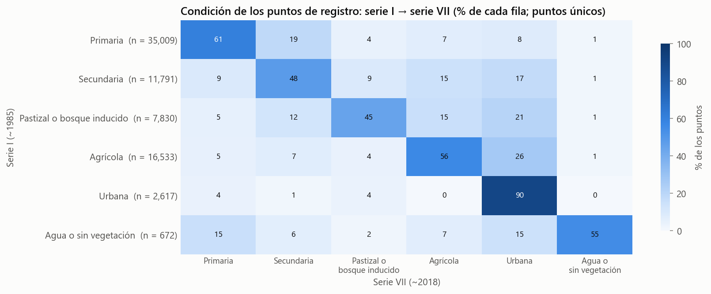
**Figura 13.** Condición de los sitios de registro en la serie I (filas) y en la serie VII (columnas), como porcentaje de cada fila.

Por zona, la proporción de sitios transformados aumentó en todas las series, pero con ritmos muy distintos (Fig. 14). La zona 14b es la más transformada (58.5% de sus sitios en la serie VII) y la zona 12 la que menos (23.1%). El cambio más pronunciado ocurrió en la península de Yucatán (zona 16), que pasó del 15.0% al 47.2% de sitios transformados, con el incremento más fuerte entre las series III (2002) y VI (2016).


**Figura 14.** Porcentaje de sitios de registro con uso agrícola, pecuario o urbano en cada serie del INEGI, por zona.

Entre las especies en riesgo o endémicas, la mayor pérdida de vegetación natural en sus sitios de registro corresponde a la musaraña *Cryptotis mayensis* (55.7% de sus sitios), la zarigüeya lanuda *Caluromys derbianus* (53.1%), el grisón *Galictis vittata* (48.9%), el puercoespín *Coendou mexicanus* (45.2%) y el zorrillo *Spilogale yucatanensis* (44.2%), todas con distribución en el sureste del país (Fig. 15).

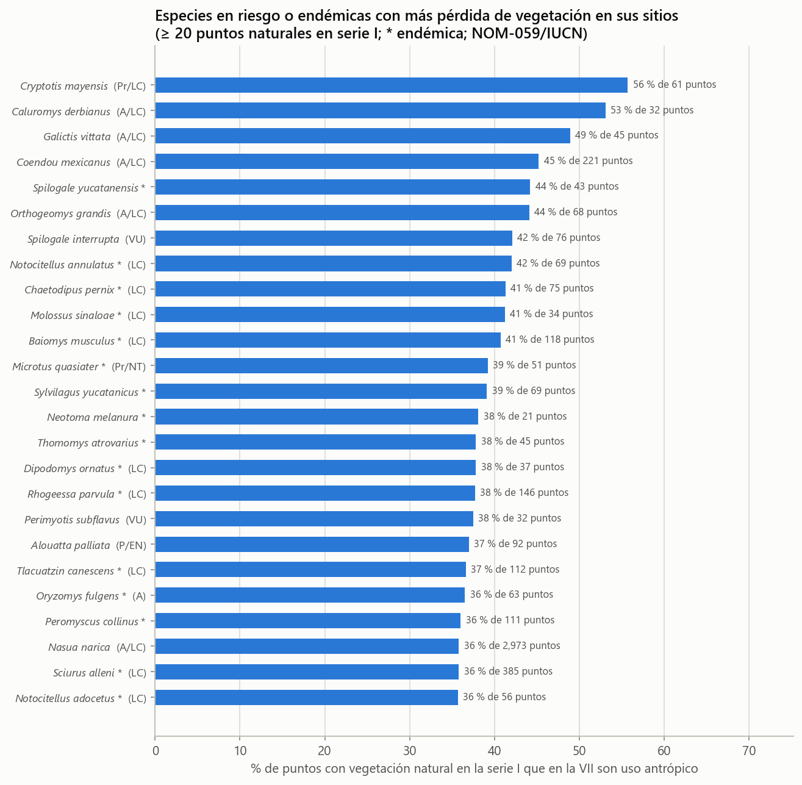
**Figura 15.** Especies en riesgo o endémicas con mayor proporción de sitios que pasaron de vegetación natural (serie I) a uso antrópico (serie VII).

Con el uso de suelo contemporáneo a cada registro, el 40.1% de los registros se ubica en suelo agrícola, pecuario o urbano. Algunas especies superan ampliamente este valor, como las tuzas del género *Cratogeomys* (85–91%) y varias ardillas, y son por tanto tolerantes a los ambientes transformados. Otras tienen menos del 5% de sus registros en esos ambientes: el tapir (*Tapirella bairdii*), el berrendo, el borrego cimarrón y *Microtus umbrosus*. De las 352 especies con al menos 30 registros, 107 son especialistas, con el 70% o más de sus registros en una sola formación vegetal. La selva perennifolia destaca porque 12 de sus 21 especialistas están en riesgo, entre ellas el mono araña (*Ateles geoffroyi*).

### Estacionalidad de murciélagos migratorios

El índice corregido por esfuerzo recupera patrones migratorios conocidos (Fig. 16):

- *Leptonycteris yerbabuenae* está sobrerrepresentada en el norte en abril y mayo (índice máximo de 1.46) y en el sur entre agosto y octubre. Este patrón es consistente con la migración primaveral de las hembras hacia los refugios de maternidad del noroeste y su regreso al sur en otoño.
- *Lasiurus cinereus* casi desaparece de los registros del sur en julio y agosto (índice de 0.1) y presenta dos máximos, en marzo–abril y en octubre–noviembre, que corresponden a sus pasos migratorios.
- *Tadarida brasiliensis* alcanza su máximo en marzo en el norte y en abril en el sur.
- *Lasiurus frantzii* muestra un perfil casi plano en ambas bandas y sirve como referencia de una especie sin migración marcada.

La corrección por esfuerzo es necesaria porque el muestreo de murciélagos es muy estacional: en el sur, por ejemplo, hay el doble de registros en enero que en febrero.

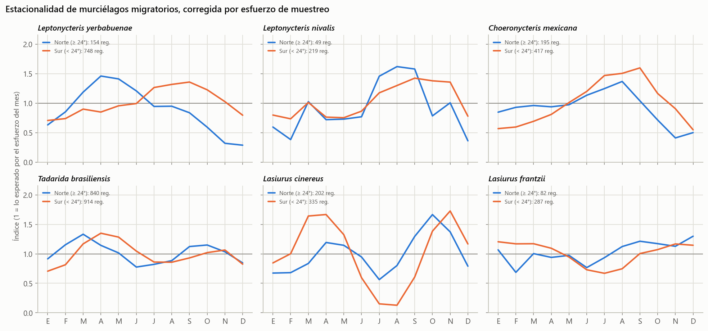
**Figura 16.** Índice de estacionalidad corregido por esfuerzo para seis especies de murciélagos migratorios, en el norte (≥ 24° N) y el sur del país. Un valor de 1 corresponde a lo esperado según el esfuerzo del mes.

### Extensión de presencia, área de ocupación y criterio B

Con los registros de México se calculó la extensión de presencia (EOO) y el área de ocupación (AOO) de 598 especies nativas terrestres; 109 de ellas no se evaluaron por tener menos de diez localidades. La AOO obtenida a partir de registros puntuales queda por debajo del umbral de «Vulnerable» (2,000 km²) en casi todas las especies, incluidas 267 especies catalogadas en preocupación menor (LC). Esto confirma que, con datos de presencia, la AOO es un mínimo que subestima la ocupación real, y que el subcriterio B1 (EOO) es más útil para priorizar especies (Fig. 17).


**Figura 17.** EOO frente a AOO de las especies con al menos diez localidades. Las líneas indican los umbrales de los subcriterios B1 y B2 de la IUCN y el color, la categoría IUCN actual.

Cinco especies alcanzan un umbral de amenaza por EOO, tanto con todos los registros como con los registros desde 2000, sin estar amenazadas en la IUCN ni incluidas en la NOM-059 (Cuadro 3). Todas son roedores y cuatro son endémicas de México. Destacan *Neotamias solivagus* y la tuza del Nevado de Toluca (*Cratogeomys planiceps*), con EOO de 1,233 y 1,753 km², respectivamente. Para comparar, el teporingo (*Romerolagus diazi*), catalogado como En Peligro, tiene una EOO de 2,441 km² en estos datos. Alcanzar un umbral no basta para asignar una categoría: el criterio B exige además fragmentación severa o pocas localidades, declive continuo o fluctuaciones extremas. Aun así, estas especies son candidatas prioritarias para una evaluación formal.

**Cuadro 3.** Especies que alcanzan un umbral de amenaza por el subcriterio B1 (EOO) sin categoría de amenaza en la IUCN ni en la NOM-059. El asterisco indica especie endémica.

| Especie | Nombre común | Localidades | EOO (km²) | Umbral B1 | IUCN |
|---|---|---:|---:|---|---|
| *Neotamias solivagus* * | — | 46 | 1,233 | EN | no evaluada |
| *Cratogeomys planiceps* * | gran tuza del Nevado de Toluca | 24 | 1,753 | EN | LC |
| *Peromyscus carletoni* * | ratón de Nayarit | 13 | 3,305 | EN | no evaluada |
| *Cratogeomys fulvescens* * | gran tuza de la Cuenca de Oriental | 35 | 12,838 | VU | LC |
| *Peromyscus carolpattonae* | ratón guatemalteco | 41 | 13,877 | VU | LC |

Al comparar la EOO reciente con la total en las especies que se siguen registrando, se observan reducciones marcadas en algunas especies en riesgo (Fig. 18). La EOO reciente representa el 2.9% de la total en *Peromyscus ochraventer* (EN), el 4.1% en *Cryptotis magnus* (VU) y el 6.7% en el perrito de la pradera de cola negra (*Cynomys ludovicianus*, P). Parte de estas reducciones puede deberse a que el muestreo reciente está más concentrado geográficamente, por lo que deben verificarse con muestreos dirigidos.

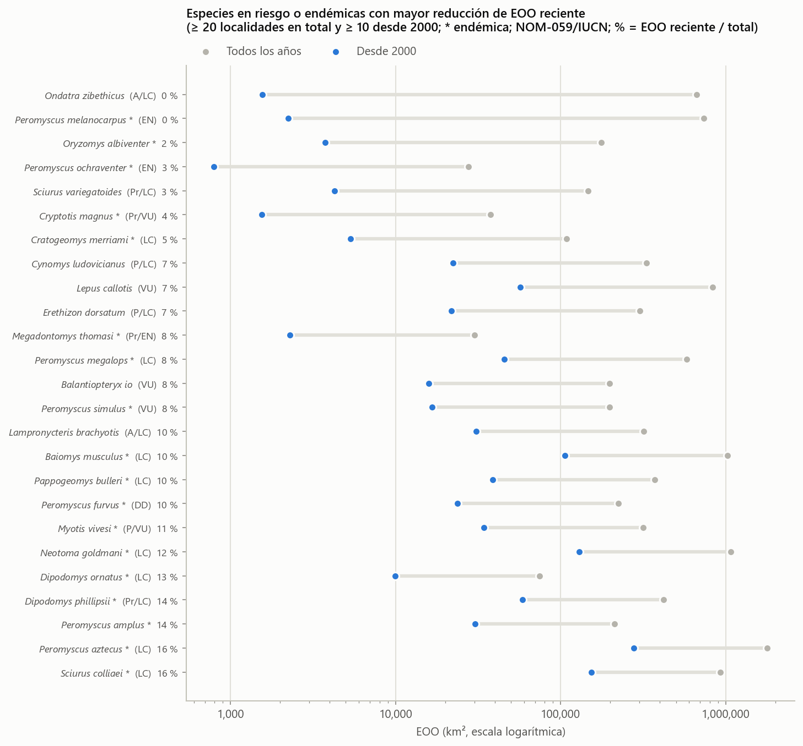
**Figura 18.** EOO con todos los registros y con los registros desde 2000, en especies en riesgo o endémicas con al menos diez localidades recientes.

---

## Limitaciones

1. **Los registros de presencia no equivalen a abundancia ni a ausencia.** Todos los análisis de riqueza se estandarizaron por esfuerzo, pero los sesgos de detectabilidad entre grupos, como murciélagos y roedores pequeños frente a mamíferos medianos y grandes, persisten.
2. **Los sitios de registro no son una muestra aleatoria del paisaje.** El cambio de uso de suelo se midió en los sitios donde se han registrado mamíferos, no en todo el territorio, y los métodos del INEGI cambiaron entre series.
3. **La taxonomía sigue la del catálogo de la CONABIO.** Las cifras de riqueza y endemismo son sensibles a separaciones y sinonimias recientes, y 109 especies con menos de diez localidades en México pueden incluir errores de identificación.
4. **Los límites de las zonas 11, 12, 13, 14b, 15 y 16 siguen los meridianos UTM estándar.** Solo la zona 14a se verificó contra el archivo correspondiente de la CONABIO.
5. **La EOO es sensible a puntos mal georreferenciados y la AOO de registros es un valor mínimo.** Ninguno de los resultados constituye una evaluación formal de riesgo.

## Conclusiones

Los registros del SNIB permiten describir con detalle los patrones de diversidad de los mamíferos de México, siempre que se controle el esfuerzo de muestreo. Una vez estandarizada, la riqueza es similar en las zonas del centro y el sur del país, y la principal diferencia entre regiones está en la identidad de las especies: la fauna cambia casi por completo de oeste a este y de norte a sur, con un reemplazo gradual de roedores por murciélagos.

Desde el punto de vista de la conservación, destacan cuatro prioridades:

1. **Las sierras de Oaxaca y Guerrero** (zona 14b) concentran especies endémicas en riesgo sin representación en las ANP.
2. **La península de Yucatán** registró la transformación más rápida de sus sitios de registro.
3. **Las especies de alta montaña** combinan endemismo, riesgo y poco margen de desplazamiento ante el cambio climático.
4. **Cinco roedores de distribución muy restringida** alcanzan umbrales de amenaza sin estar catalogados y merecen una evaluación formal.

Finalmente, el declive de la colecta científica desde la década de 1960 y el predominio actual de las observaciones ciudadanas implican que los grupos que requieren captura tienen cada vez menos registros. Por ello, mantener programas de colecta y de monitoreo dirigido es indispensable para distinguir los declives reales de la falta de muestreo.

---

## Literatura citada

Baselga, A. 2010. Partitioning the turnover and nestedness components of beta diversity. *Global Ecology and Biogeography* 19:134–143.

Chao, A. 1984. Nonparametric estimation of the number of classes in a population. *Scandinavian Journal of Statistics* 11:265–270.

Chao, A. y L. Jost. 2012. Coverage-based rarefaction and extrapolation: standardizing samples by completeness rather than size. *Ecology* 93:2533–2547.

CONABIO (Comisión Nacional para el Conocimiento y Uso de la Biodiversidad). 2025. Sistema Nacional de Información sobre Biodiversidad (SNIB): ejemplares de mamíferos, versión 2025-03. CONABIO, Ciudad de México.

Gotelli, N. J. y R. K. Colwell. 2001. Quantifying biodiversity: procedures and pitfalls in the measurement and comparison of species richness. *Ecology Letters* 4:379–391.

Hurlbert, S. H. 1971. The nonconcept of species diversity: a critique and alternative parameters. *Ecology* 52:577–586.

INEGI (Instituto Nacional de Estadística y Geografía). Conjunto de datos vectoriales de uso del suelo y vegetación, escala 1:250 000, series I a VII. INEGI, Aguascalientes.

IUCN Standards and Petitions Committee. 2024. *Guidelines for using the IUCN Red List Categories and Criteria*. Versión 16. IUCN, Gland.

Levins, R. 1968. *Evolution in changing environments*. Princeton University Press, Princeton.

Rzedowski, J. 1978. *Vegetación de México*. Limusa, Ciudad de México.

Sánchez-Cordero, V., F. Botello, J. J. Flores-Martínez, R. A. Gómez-Rodríguez, L. Guevara, G. Gutiérrez-Granados y Á. Rodríguez-Moreno. 2014. Biodiversidad de Chordata (Mammalia) en México. *Revista Mexicana de Biodiversidad* 85 (Supl.). https://doi.org/10.7550/rmb.31688

SEMARNAT (Secretaría de Medio Ambiente y Recursos Naturales). 2010. Norma Oficial Mexicana NOM-059-SEMARNAT-2010, Protección ambiental–Especies nativas de México de flora y fauna silvestres–Categorías de riesgo y especificaciones para su inclusión, exclusión o cambio–Lista de especies en riesgo. *Diario Oficial de la Federación*, 30 de diciembre de 2010.

SEMARNAT. 2019. Modificación del Anexo Normativo III, Lista de especies en riesgo de la Norma Oficial Mexicana NOM-059-SEMARNAT-2010. *Diario Oficial de la Federación*, 14 de noviembre de 2019.

---

## Anexo: reproducibilidad

Todos los resultados se generan desde la raíz del proyecto con el Python del entorno virtual:

```
.\venv\Scripts\python.exe ejecutar_todo.py
```

Las tablas completas que respaldan cada figura y cifra se encuentran en `outputs/<módulo>/*.csv`. Las figuras de este documento son una copia de `outputs/` al momento de su redacción; si los datos o los parámetros cambian, deben volver a copiarse.
